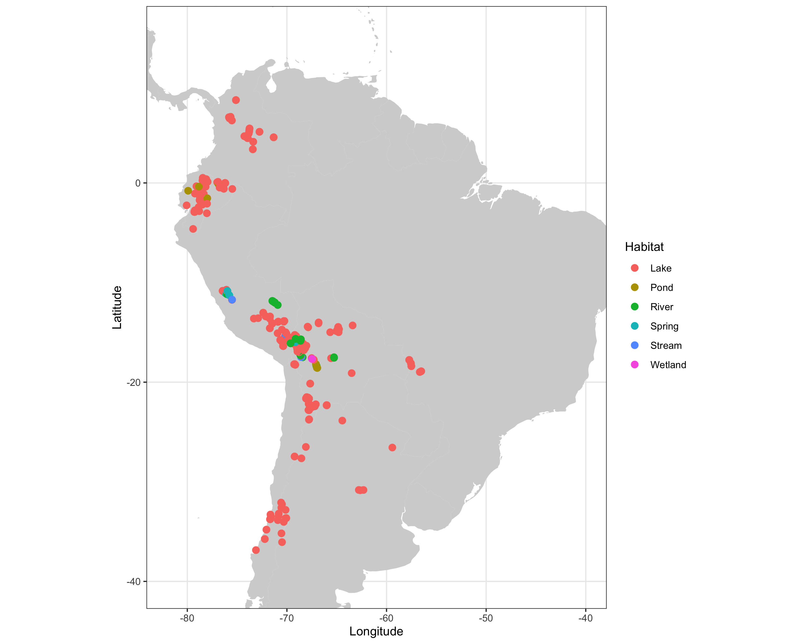

# Tropical South American Diatom Database

<!-- README.md is generated from README.Rmd. Please edit that file -->

This repository contains the code and data for contemporary diatom datasets of tropical South America.
The [database](http://www.xavierbenito.com/bgsa/bgsa.html) includes diatom (unicelular siliceous algae) data and associated environmental variables of waterbody sites (streams, wetlands, lakes), covering an altitudinal gradient from 220 to 5,070 m a.s.l. between 8°N–30°S and 58–79°W.

Datasets are mostly available on [Dryad](https://datadryad.org/resource/doi:10.5061/dryad.ck7pt) while here the aim is to provide a [shiny](http://shiny.rstudio.com) app to interactively explore the database in R for promoting biodiversity, biogeographic and paleolimnological studies in tropical South America.

### Database visualization
A table with geographical coordinates of sites is available (file <i>biogeographySites.csv</i>) in the <i>data</i> folder. 

<pre><code>read.csv("data/biogeographySites.csv", stringsAsFactors = FALSE) 
world <- map_data("world")
southamerica <- ggplot() +
  geom_polygon(data = world, aes(x=long, y = lat, group = group), fill="lightgrey") +
  geom_point(data=sites_map, aes(x=Long.DD.W, y=Lat.DD.S, col=Habitat), shape=20, size=4)+
  coord_map("albers", parameters = c(-100, -100),  ylim=c(-40,15), xlim=c(-82,-40)) +
  xlab("Longitude") + ylab("Latitude") +
  theme_bw()</pre></code>
</img>

The database is also available for visualisation through the **R Markdown** file `diatom-biogepgraphy-southamerica`

### Database exploration

To explore the database, run the <i>database_shiny.R</i> file. 

