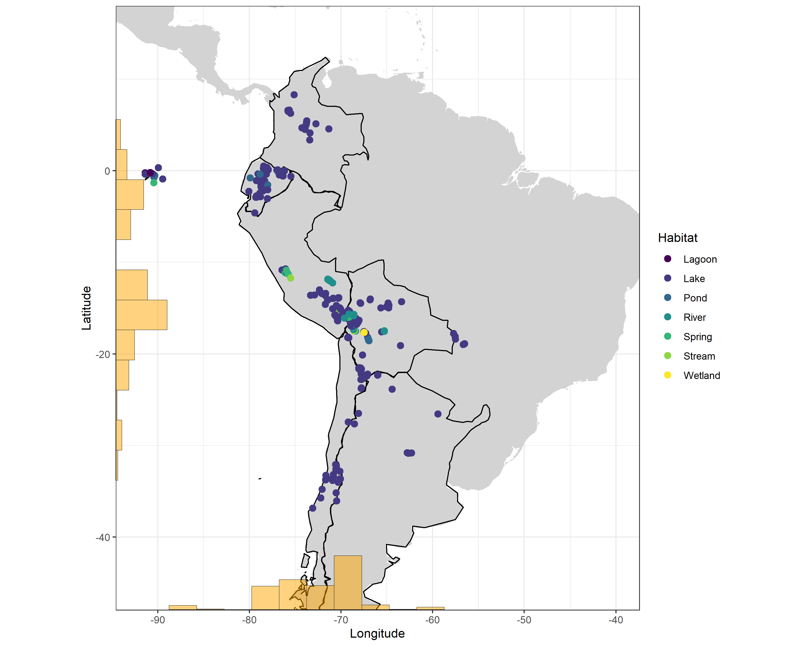

# Tropical South American Diatom Database

<!-- README.md is generated from README.Rmd. Please edit that file -->

This repository contains the code and data of contemporary (1980s - 2017) diatom datasets of tropical South America (TSADB).
The [database](http://www.xavierbenito.com/bgsa/bgsa.html) includes diatom (unicelular siliceous algae) data and associated environmental variables of waterbody sites (streams, wetlands, lakes), covering an altitudinal gradient from 220 to 5,070 m a.s.l. between 8°N–30°S and 58–79°W.

Datasets are available as Excel Data Tables on [Dryad](https://doi.org/10.5061/dryad.jm63xsjbs) and [Zenodo](https://doi.org/10.5281/zenodo.5415446) as R files, while here the aim is to provide a [shiny](http://shiny.rstudio.com) app to interactively **visualize** and **explore** the database in R for promoting biodiversity, biogeographic and paleolimnological studies in tropical South America.

### Database visualization
A table with geographical coordinates of lakes is available (file <i>biogeographySites.csv</i>) in the <i>data</i> folder. 

<pre><code>read.csv("data/biogeographySites.csv", stringsAsFactors = FALSE) 
world <- map_data("world")
southamerica <- ggplot() +
  geom_polygon(data = world, aes(x=long, y = lat, group = group), fill="lightgrey") +
  geom_point(data=sites_map, aes(x=Long.DD.W, y=Lat.DD.S, col=Habitat), shape=20, size=4)+
  coord_map("albers", parameters = c(-100, -100),  ylim=c(-40,15), xlim=c(-82,-40)) +
  xlab("Longitude") + ylab("Latitude") +
  theme_bw()</pre></code>
</img>

The database is also available for visualisation through the **R Markdown**  `diatom-biogeography-southamerica.Rmd` file

### Database exploration
To explore the database, run the `database_shiny.R` file in the <i>R scripts</i> folder. The output generates the following files for each study region:

<ul>
<li><b>Region</b> table with basic site's information (e.g. year, site name, saple type)</li>
<li><b>Map:</b> Geographical distribution of sites</li>
<li><b>Environment-table:</b> variables for the physical habitat, water chemistry, and geo-climatic context</li>
<li><b>Environment-boxplots:</b> Boxplots for selected environmental variables</li>
<li><b>Taxa:</b> Site-by-species data matrix</li>
<li><b>Ecological groups:</b> Relative proportion of diatom ecological groups (freshwater planktic, oligosaline planktic, tychoplanktic, benthic, epiphytic, and saline)</li>

</ul>

### Database contributor guide
Check out the `contributor_guide.md` file for a guide on how to share your data for the Tropical South American Database. 

