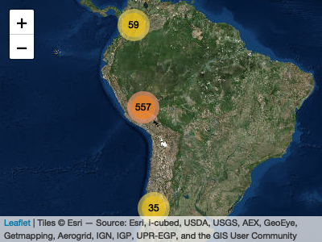
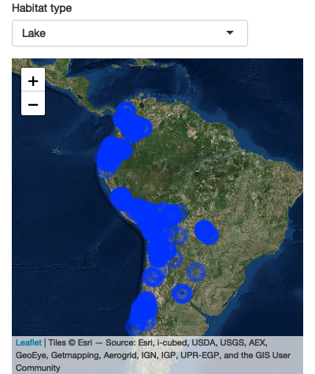

Tropical South American Diatom Database
================
Xavier Benito and multiple collaborators

<!-- README.md is generated from README.Rmd. Please edit that file -->
This repository contains a georeferenced inventory of diatom sites of tropical South America.
The [database](http://www.xavierbenito.com/bgsa/bgsa.html) includes diatom (unicelular siliceous algae) data and associated environmental variables of waterbody sites (streams, wetlands, lakes), covering an altitudinal gradient from 220 to 5,070 m a.s.l. between 8°N–30°S and 58–79°W.

Datasets are mostly available on [Dryad](https://datadryad.org/resource/doi:10.5061/dryad.ck7pt) while here the aim is to provide a [leaflet](https://rstudio.github.io/leaflet/) map and [shiny](http://shiny.rstudio.com) app to interactively explore the database in R for promoting biodiversity, biogeographic and palaeoecological studies in tropical South America using diatoms as sentinel organisms.

``` r
library(leaflet)
library(tidyverse)
## ── Attaching packages ───────────────────────────────────────────────────────────────────────────────── tidyverse 1.2.1 ──
## ✔ ggplot2 3.0.0     ✔ purrr   0.2.5
## ✔ tibble  1.4.2     ✔ dplyr   0.7.7
## ✔ tidyr   0.8.1     ✔ stringr 1.3.1
## ✔ readr   1.1.1     ✔ forcats 0.3.0
## ── Conflicts ──────────────────────────────────────────────────────────────────────────────────── tidyverse_conflicts() ──
## ✖ dplyr::filter() masks stats::filter()
## ✖ dplyr::lag()    masks stats::lag()
library(shiny)
```

Load inventory of sites

``` r
diatom_data <- read.csv("data/Diatom_Biogeography_South_America_DB-def.csv", stringsAsFactors = FALSE)

head(diatom_data)
##   id     lat    long        SiteName               Collection Substrate
## 1  1 -11.841 -71.466    Cocha Maizal Amazon Lowland (Manu NP)          
## 2  2 -11.855 -71.455     Cocha Nueva Amazon Lowland (Manu NP)          
## 3  3 -11.875 -71.391    Cocha Totora          Amazon Lowlands  epipelon
## 4  4 -11.884 -71.408     Cocha Cashu Amazon Lowland (Manu NP)          
## 5  5 -11.951 -71.320 Cocha Gallareta Amazon Lowland (Manu NP)          
## 6  6 -11.994 -71.218  Cocha Salvador Amazon Lowland (Manu NP)          
##   Collector.Analyst       SampleType Habitat Year               region
## 1             Fritz         core top   River 2013 Peru-Amazon Lowlands
## 2             Fritz         core top   River 2013 Peru-Amazon Lowlands
## 3             Fritz surface sediment   River 2013 Peru-Amazon Lowlands
## 4             Fritz         core top   River 2013 Peru-Amazon Lowlands
## 5             Fritz         core top   River 2013 Peru-Amazon Lowlands
## 6             Fritz         core top   River 2013 Peru-Amazon Lowlands
```

Filter out non-tropical sites and artifical habitats

``` r
diatom_subset <- diatom_data %>% filter(!region=="Tierra del Fuego" & !Habitat=="channel")
```

Create a leaflet map. Click on the markers to see site's basic information

``` r
map <- leaflet() %>% 
  addProviderTiles("Esri.WorldImagery") %>% 
  addMarkers(lat = diatom_subset$lat, 
             lng = diatom_subset$long,
             clusterOptions = markerClusterOptions(),
             popup = paste("<strong>", "Site: ", "</strong>", as.character(diatom_subset$SiteName), "<br>",
                           "<strong>", "Habitat: ", "</strong>", as.character(diatom_subset$Habitat), "<br>",
                           "<strong>", "Sample type: ", "</strong>", as.character(diatom_subset$SampleType), "<br>",
                           "<strong>", "Collection: ", "</strong>", as.character(diatom_subset$Collection), "<br>",
                           "<strong>", "Year: ", "</strong>", as.character(diatom_subset$Year)))
                           
map 
```



Create a shiny map to display habitat types. Click on the markers to see site's basic information

``` r
shinyApp(
  ui = fluidPage(
     tags$div(title = "This input has a tool tip",
             selectInput(inputId = "habitat", 
                         label = "Habitat type", 
                         choices = sort(unique(diatom_subset$Habitat)))),
    leafletOutput("MapPlot1")
  ),
  
  server = function(input, output) {
    
    output$MapPlot1 <- renderLeaflet({
      leaflet() %>% 
        addProviderTiles("Esri.WorldImagery") %>% 
        setView(lng = -68, lat = -15, zoom = 3)
    })
    
    observe({
      
      habitat <- input$habitat
      
      sites <- diatom_subset %>% 
        filter(diatom_subset$Habitat %in% habitat)
      
   leafletProxy("MapPlot1") %>% clearMarkers() %>% 
   addCircleMarkers(lng = sites$long,
                   lat = sites$lat,
                   popup = paste("<strong>", "Site: ", "</strong>", as.character(sites$SiteName), "<br>",
                           "<strong>", "Habitat: ", "</strong>", as.character(sites$Habitat), "<br>",
                           "<strong>", "Sample type: ", "</strong>", as.character(sites$SampleType), "<br>",
                           "<strong>", "Collection: ", "</strong>", as.character(sites$Collection), "<br>",
                           "<strong>", "Year: ", "</strong>", as.character(sites$Year)))

    })
  },
  options = list(height = 600)
)
## 
## Listening on http://127.0.0.1:3441
```


